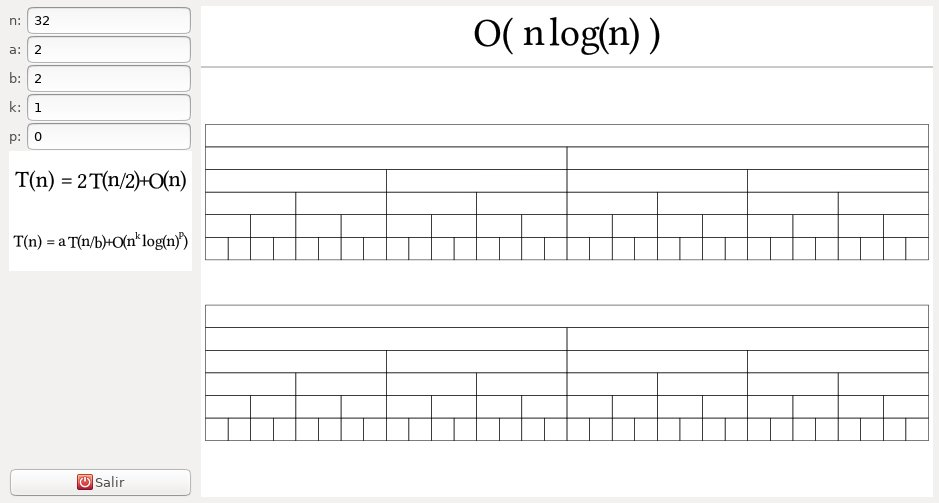

# Maestro
## Gaphical representation of the master theorem

### Introduction

This program shows a graphical representation of the
[master theorem](https://en.wikipedia.org/wiki/Master_theorem_(analysis_of_algorithms)).

### Usage

The parameters are:

+ `n`: the size of the initial problem.

+ `a`: the number of parts in which the problem is divided.

+ `b`: the fraction of the initial size.

+ `k` and `p`: the cost of the computation in each level is O(n^k log^p(n)).

The screen shows three elements:

+ The cost of the algorithm in big O notation is shown in the (resizeable)
  upper part.

+ A representation of the sizes of the instances, one bar for each
  instance and organized in levels. The width of each bar represents
  its size and the height is one. The first bar has the size of the
  parameter `n` and each child has the size resulting of dividing the
  height of its parent by `b`. If the number of instances is too high,
  what is represented is a list of the number of bars and theirs
  sizes.

+ A representation of the costs of the instances, one bar for each
  instance and organized in levels. The structure is similar to that
  of the instances but the height of the bar is the result of the cost
  divided by the base so that the area is the total cost. In case of
  unit costs (i.e. if `k` and `p` are 0) the bars are unit
  squares. Like in the case of the instances, if there are many
  instances, numbers are used.

### Installation

As *maestro* is written in [haskell](https://www.haskell.org), the
easiest way to compile it is to use *stack*:

+ Install stack as explained [here](https://docs.haskellstack.org/en/stable/README/).

+ Compile *maestro* using `stack build`. Beware, the first time it may
  take a long time since *stack* will instal the haskell compiler and
  the auxlliary libraries.

+ Execute with `stack exec maestro`. If you prefer to install it, you can use `stack install`.
